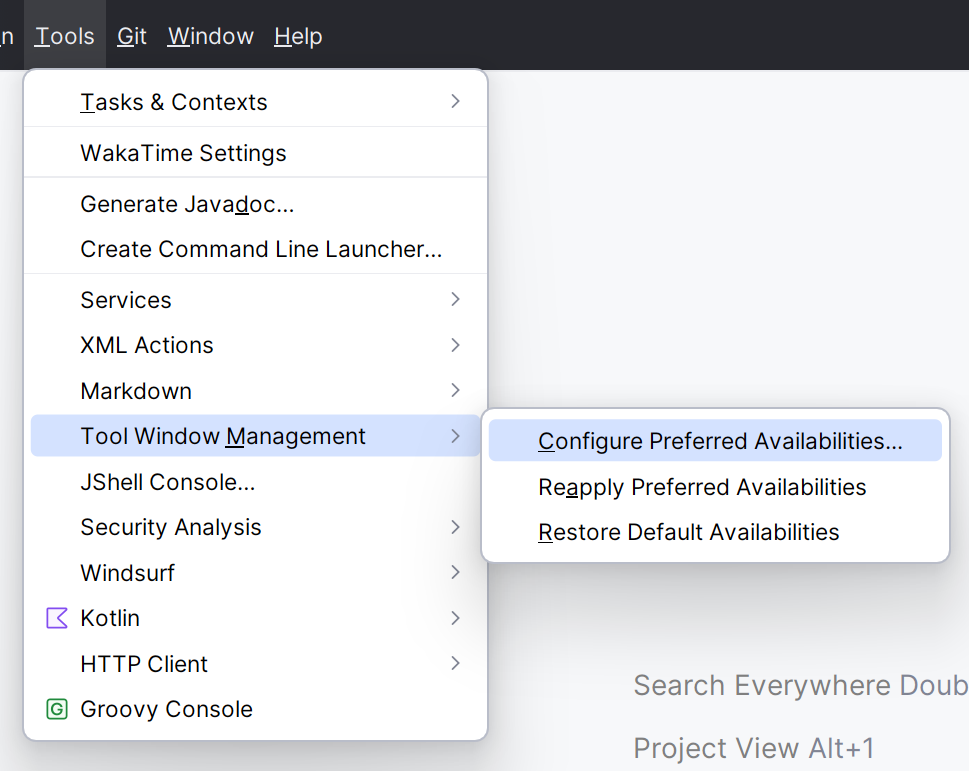
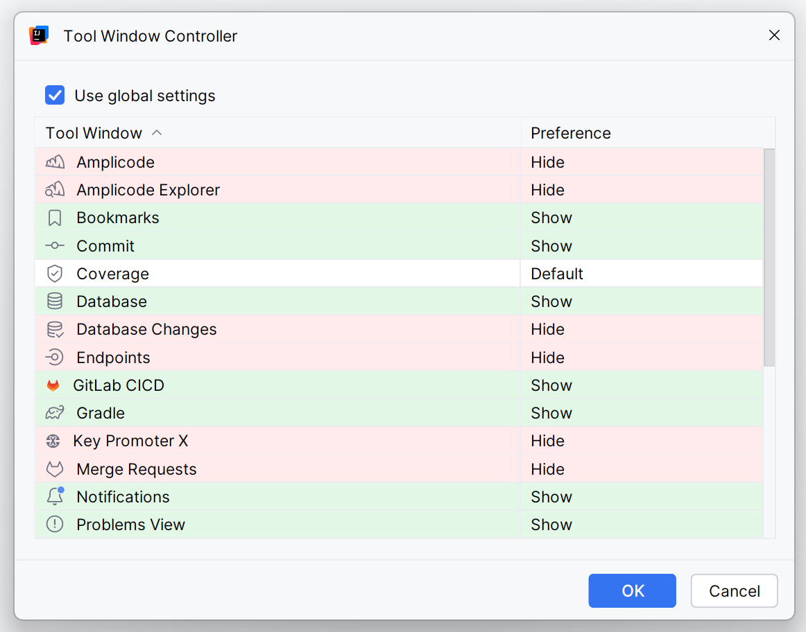

# 🔧 ToolWindow Manager Advanced for IntelliJ IDEA

**A modern rework of the original [ToolWindow Manager](https://plugins.jetbrains.com/plugin/1489-toolwindow-manager)**  
**✅ Compatible with IntelliJ IDEA 2024.2+**

This plugin lets you configure visibility preferences for well-known tool windows like *Bookmarks*, *Notifications*,
etc., and ensures they automatically show or hide depending on the project.

---

## ✨ Features

- Set preferred availability for any tool window per project
- Supports both global and project-level preferences
- Automatically restores visibility states on project open
- Includes "Reset to Defaults" option

---

## 🧾 Notes

- Version `1.0.0` was written in **Java**
- From version `1.1.0` onward, the plugin is written in **Kotlin**
- **Project-level settings** are stored in: `.idea/toolwindow-manager-settings.xml`
- **Global settings** are stored in:
- On *Windows*: `%APPDATA%\JetBrains\IntelliJIdea<version>\options`
- On *macOS*: `~/Library/Application Support/JetBrains/IntelliJIdea<version>/options`
- On *Linux*: `~/.config/JetBrains/IntelliJIdea<version>/options`

---

## 🧭 Usage

To access the configuration:

- Open `Tools` → `Tool Window Management` → `Configure Preferred Availabilities`

<p align="center">
  
</p>

<p align="center">
  
</p>

---

## 🛠️ Installation

### ✅ Method 1: Pre-built Package (Recommended)

1. Download the latest release from
   the [Releases section](https://github.com/IlyaPukhov/toolwindow-manager-advanced/releases)
2. Install the plugin in IntelliJ IDEA:
    - Go to `Settings` → `Plugins`
    - Click the ⚙️ icon (gear) → `Install Plugin from Disk...`
    - Select the downloaded `.zip` file
3. Restart the IDE if prompted

---

### 🧪 Method 2: Build from Source

If you want to build the plugin yourself:

1. Clone the repository:
   ```bash
   git clone https://github.com/IlyaPukhov/toolwindow-manager-advanced.git
   cd toolwindow-manager-advanced
   ```

2. Open the project in IntelliJ IDEA — it will be automatically recognized as a plugin project

3. Build the plugin using the following command:
   ```bash
   ./gradlew clean buildPlugin
   ```

4. The packaged plugin will be located at:
   ```
   build/distributions/toolwindow-manager-advanced-{version}.zip
   ```

5. Install the plugin in IntelliJ IDEA:
    - Go to `Settings` → `Plugins`
    - Click the ⚙️ icon → `Install Plugin from Disk...`
    - Select the generated `.zip` file
6. Restart the IDE if prompted
