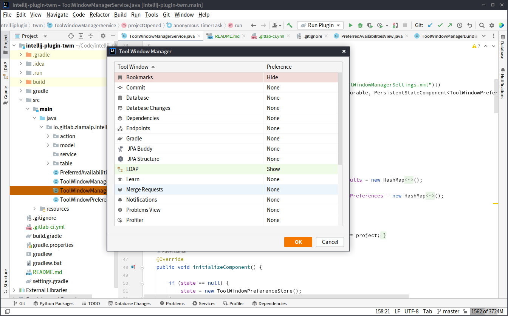

# ToolWindow Manager Advanced for IntelliJ IDEA

***Rework of [ToolWindow Manager](https://plugins.jetbrains.com/plugin/1489-toolwindow-manager) plugin for IntelliJ IDEA
2024.2+***

Plugin allows you to set visibility preferences to known Tool Windows like
*Bookmarks*, *Notifications* etc. and automatically show or hide them for
each project.



### How to build / run / install plugin

If you open the project in Intellij IDEA, it will be recognized as IDE plugin. **Gradle (>=8.12)** is used to build the
plugin and manage its dependencies. If necessary, you can build plugin from sources using command:

```shell script
./gradlew buildPlugin
``` 

It will produce packaged zip file at:

```
build/distributions/twm-advanced-plugin-{version}.zip
```

and it can be later manually installed into Intellij IDEA using its *Settings... -> Plugins -> Cog icon on top ->
Install Plugin from Disk...* option.
